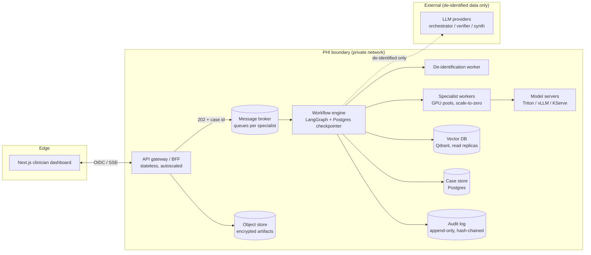
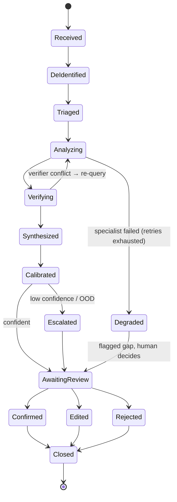

# 08 — Scalability & Production Architecture

The pipeline in [02](02-architecture.md) describes *what* happens to a case. This
doc describes *how* it runs at scale without breaking the "ship one vertical first"
discipline.

## Guiding principle — the walking skeleton

We do **not** build a full distributed platform before the first vertical. We build
a **thin slice of every production concern from Phase 0** — one queue, one worker,
one trace, one audit entry, one RBAC role — so that scaling later means turning dials
(more workers, more replicas), not re-architecting. Every concern is *present* in
the MVP; none is *complete*. Retrofitting async, auth, audit, or observability into
a synchronous prototype is the expensive path we are explicitly avoiding.

## Why the synchronous pipeline had to change

A single 3D CT/MRI inference can take **seconds to minutes**. If that runs inside a
FastAPI request handler, one slow case blocks a worker, timeouts cascade, and a
crash mid-pipeline loses the case. Medical workloads are **long-running, bursty, and
must not lose work**. So the case is an **asynchronous, durable, event-driven
workflow** — not a blocking request.

## Container view (tiers scale independently)

Each box is a separately deployable, separately scalable unit. The **API gateway is
stateless** (scale horizontally on RPS); **specialist workers scale on queue depth**
(KEDA/HPA); **model servers scale on GPU utilization** and batch requests; the
**workflow engine** is durable so a worker crash resumes from the last checkpoint,
not from zero.

**Current walking-skeleton implementation:** the in-process stand-in is a single
Python `threading.Thread` consuming an in-memory `queue.Queue`, running inside the
FastAPI process, with `SQLiteCaseStore` as the case/audit store — not yet a separate
message broker, a distributed workflow engine, or Postgres. This satisfies the
"thin slice of every concern" principle (a queue and a worker both exist and the
state machine below is real) without yet being horizontally scalable or
crash-durable across process restarts. Tracked in
[14 — Implementation Status](14-implementation-status.md).

## Case lifecycle — the state machine

A case is an event-sourced entity. Every transition emits an event (to the audit log
and the data platform). This replaces the "top-to-bottom" reading of the pipeline.

`Degraded` is the key resilience state: if a specialist dies, the case does **not**
fail silently — it reaches the clinician with an explicit "analysis unavailable for X"
flag. Never fabricate a finding to fill a gap.

## Scaling axes

| Concern | Bottleneck | Scaling lever |
|---------|-----------|---------------|
| Intake | RPS on the API | Stateless gateway replicas behind a load balancer |
| Orchestration | Concurrent in-flight cases | Workflow-engine workers + Postgres connection pooling |
| Imaging inference | GPU throughput | Per-specialist worker pools, autoscale on queue depth, scale-to-zero for rare verticals |
| Model serving | Latency / batch efficiency | Dynamic batching at Triton/vLLM; separate hot (CXR) vs. heavy (CT/MRI) pools |
| LLM calls | Tokens/sec, rate limits, $$ | LLM gateway with caching, retries, provider fan-out; calibration-gated verification (below) |
| Retrieval | Query QPS | Qdrant read replicas; cache hot retrievals |
| Delivery | Concurrent clinicians | SSE/WebSocket fan-out; the dashboard reads case state, doesn't poll models |

## Multi-tenancy (this is a startup selling to multiple sites)

- **Tenant/site is a first-class dimension** on every case, model call, and metric.
- **Per-site calibration.** Scanner and population differ by hospital — the OOD
  detector and confidence thresholds are calibrated *per site*, not globally. This
  turns the safety story ([06](06-compliance-safety.md)) into a scaling feature:
  onboarding a new site = fitting its calibration, not retraining.
- **Data isolation** by tenant (row-level security or separate schemas; separate
  object-store prefixes with per-tenant keys).
- **Per-tenant config:** which verticals are enabled, thresholds, routing rules.

## Resilience patterns (non-negotiable in healthcare)

- **Timeouts + retries with exponential backoff** on every model/LLM call.
- **Circuit breakers** around external LLM providers and model servers; open circuit
  → route the case to `Degraded`, not to a hang.
- **Idempotency keys** on case submission so a retried upload doesn't duplicate a case.
- In the current walking skeleton this is surfaced directly at the API boundary via
  the `Idempotency-Key` header on `POST /v1/cases`.
- **Dead-letter queue** for cases that exhaust retries → on-call review, never dropped.
- **Durable checkpointing** (LangGraph Postgres checkpointer) so no case is lost on
  crash/deploy. Alternative to evaluate at scale: **Temporal** for durable execution
  if LangGraph's checkpointing proves insufficient — logged as an open decision (D13).
- **Graceful degradation:** a missing specialist yields a flagged gap; a missing
  verifier forces mandatory escalation (never ship an unverified finding as confident).

## Calibration-gated verification (scale + cost + safety in one lever)

The heterogeneous verifier ([D6](07-risks-decisions.md)) roughly **doubles LLM cost**
if it runs on every finding. Instead, gate its intensity by calibration:

- High-confidence, in-distribution, low-stakes finding → lightweight cross-check.
- Low-confidence, OOD, or high-stakes finding → full heterogeneous critique + re-query loop.

This spends verification budget where it changes outcomes, and it's the same signal
that drives escalation — one mechanism, three wins (cost, latency, safety).

## Non-functional requirements (initial targets — tune with real data)

| NFR | Initial target |
|-----|----------------|
| CXR (2D) case latency, p95 (excl. human review) | < 60 s |
| CT/MRI (3D) case latency, p95 | < 5 min |
| Intake API availability | 99.9% |
| Case durability (no loss on crash) | 100% — checkpointed |
| Throughput | Linear in GPU workers; N concurrent cases/worker (measure in Phase 4 load test) |
| Escalation transparency | 100% of low-confidence cases logged + flagged |
| RPO / RTO (disaster recovery) | RPO ≤ 15 min, RTO ≤ 1 h (define formally pre-pilot) |

These are **SLOs**, not vanity numbers — they drive alerting (see [10](10-observability-mlops.md))
and the Phase-4 load test.

## Cost levers (startup runway matters)

- **Calibration-gated verification** (above) — biggest LLM-spend lever.
- **GPU scale-to-zero** for rare verticals; keep only CXR warm early.
- **Batch** at the model server; **cache** embeddings, RAG retrievals, and LLM
  prompt prefixes.
- **Right-size the critic:** the verifier can be a smaller/cheaper *different* model —
  heterogeneity matters more than raw size for catching a specialist's mistakes.
- **Track cost per case** as a first-class metric from day one ([10](10-observability-mlops.md)).
