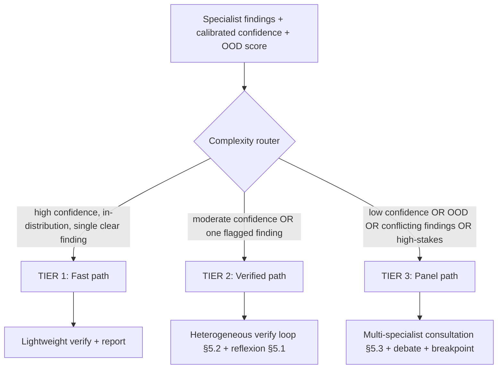

# 15 — Agentic Architecture: adaptive collaboration, bounded loops, consensus

This doc upgrades the agent layer from the linear roster in
[02 — Architecture](02-architecture.md) to a **professional-grade agentic system**
whose single design goal is *diagnostic accuracy under a controlled cost/latency
budget*. It is grounded in an analysis of how the strongest real-world clinical
multi-agent systems actually work, and it commits to one core discipline:
**every agent loop is bounded, budgeted, and deterministically terminating** —
"agents in loops for sure things," never open-ended agents that wander.

It extends [02](02-architecture.md); it does not replace it. The ports
([03](03-tech-stack.md)), the case state machine
([08](08-scalability-architecture.md)), the heterogeneous-verifier rule
([D6](07-risks-decisions.md)), and the mandatory human-confirm gate
([06](06-compliance-safety.md)) all still hold.

> **Implementation status:** §5.1 (reflexion) and §5.2 (heterogeneous
> verify↔re-query) are **implemented and tested** — `packages/core/src/aegis_dx/consensus.py`
> (Cohen's κ, complexity classification), `WorkflowRuntime`'s bounded loop in
> `workflow.py`, and `ReflexiveSynthesisAdapter` in `composition.py`. All
> reasoning is deterministic (rule-based evaluators/repairs), matching this
> project's "adapt existing HF/API models, don't train new ones" constraint —
> the same interface a real LLM-backed critique step would implement, so
> wiring one in later is a drop-in change, not a redesign. §5.3 (consultation/
> debate for Tier-3 panels) is **not yet implemented** — it needs a second
> specialist genuinely in the panel to be meaningful (see §11). See
> [14 — Implementation Status](14-implementation-status.md) for the full picture.

---

## 1. The accuracy thesis

Naive single-model diagnosis hallucinates and is over-confident. The literature
shows the fix is not "a bigger model" but *structured collaboration + adaptive
effort + cross-checking*:

- **MDAgents** (NeurIPS 2024) — an adaptive framework where a *moderator* triages
  each query's complexity and *recruits* either a single primary-care-style agent
  or a multi-disciplinary team accordingly. Best-in-class on 7/10 medical
  benchmarks; moderator review + external knowledge gave an **average +11.8%
  accuracy**. ([arxiv.org/abs/2404.15155](https://arxiv.org/abs/2404.15155))
- **ColaCare** (WWW 2025) — a *MetaAgent* orchestrates a panel of *DoctorAgents*
  through **evidence-based consultation rounds until consensus**, fusing numeric
  expert models with LLM reasoning and grounding every claim in a retrieved
  medical guideline (RAG over the Merck Manual). Superior on mortality and
  readmission prediction. ([arxiv.org/abs/2410.02551](https://arxiv.org/abs/2410.02551),
  [github.com/PKU-AICare/ColaCare](https://github.com/PKU-AICare/ColaCare))
- **Agentic design patterns** (2025–26) — the production-validated primitives are
  **orchestrator-worker** (dynamic task decomposition), **reflexion**
  (actor → evaluator → self-critique → retry, for reliability), and
  **debate / maker-checker** (for verification) — with an explicit warning that
  naive debate causes **sycophancy cascades** (agents agreeing with the majority
  even when wrong) and **cost blowups** (a 3-agent × 5-round debate = 15 LLM
  calls per case). ([huggingface.co/blog/dcarpintero/design-patterns-for-building-agentic-workflows](https://huggingface.co/blog/dcarpintero/design-patterns-for-building-agentic-workflows),
  [online.stevens.edu/blog/building-self-healing-ai-orchestrator-reflexion-patterns](https://online.stevens.edu/blog/building-self-healing-ai-orchestrator-reflexion-patterns/))
- **LangGraph in production** — durable checkpointing (resume any node), streaming
  + breakpoints for human-in-the-loop, and the guidance that **medical/legal
  agents should set quality thresholds near 1.0** (vs ~0.7 for creative tasks).
  ([towardsdatascience.com/langgraph-201-adding-human-oversight](https://towardsdatascience.com/langgraph-201-adding-human-oversight-to-your-deep-research-agent/))

**Our design = MDAgents' adaptive recruitment + ColaCare's consensus consultation
+ reflexion self-correction, all made bounded, calibration-gated, and
audit-traced — with heterogeneity and a hard human gate as the anti-hallucination
spine.**

## 2. What we borrow from each system (and what we deliberately don't)

| System | Core idea | We adopt | We avoid / adapt |
|--------|-----------|----------|------------------|
| **MDAgents** | Moderator triages complexity → recruits solo vs. team | **Adaptive complexity router** (§4) — spend agent effort where the case is hard | Its recruitment is prompt-only; ours is calibration-gated on real specialist confidence + OOD signals, not just an LLM's guess |
| **ColaCare** | MetaAgent runs DoctorAgent consultation rounds to consensus; numeric expert models feed LLM reasoning; RAG grounds claims | **Consultation loop** (§5.3) with a `SynthesisAgent` as MetaAgent; our imaging/signal **specialist adapters are the numeric expert models**; RAG already in the pipeline | Cap consultation rounds hard (cost); measure consensus with **Cohen's κ**, not "the agents stopped arguing" |
| **MDTeamGPT** | Multi-round consultation + reusable shared case memory (self-evolution) | **Case memory** feeds the retrieval agent from *confirmed* prior cases (the LEARN step, [02](02-architecture.md) step 10) | Only clinician-**confirmed** cases enter memory — never a model's own unreviewed output (avoids self-reinforcing error) |
| **Agent Hospital** | Simulated environment for agents to evolve on synthetic patients | **Synthetic-case generation for eval/ablation only** ([11](11-engineering-practices.md)) | Not in the live diagnostic path — simulation is a test harness, not a clinical input |
| **Reflexion pattern** | Actor → evaluator → verbal self-critique → retry | **Reflexion loop** (§5.1) inside each LLM-backed agent | Bounded to ≤2 self-revisions; a persistent failure escalates, it doesn't loop forever |
| **Debate pattern** | Multiple agents argue to surface errors | **Heterogeneous verify loop** (§5.2) + high-complexity debate | Heterogeneous models + a mandated **devil's-advocate role** to break sycophancy; hard call-budget cap |

## 3. Design principles (non-negotiable)

1. **Every loop is bounded and budgeted.** Max iterations, a token budget, and a
   wall-clock timeout — enforced by the orchestrator, not left to an agent to
   "decide it's done." A loop that hits its bound without converging **escalates
   to a human**; it never silently returns a low-quality answer or spins.
2. **Heterogeneity is the anti-sycophancy control.** Any two agents that
   cross-check each other must be *different models/providers* ([D6](07-risks-decisions.md)).
   Debate/consultation additionally seats a dedicated **devil's-advocate** whose
   only job is to argue against the emerging consensus.
3. **Calibration-gated effort.** Cheap path for easy, high-confidence,
   in-distribution cases; expensive multi-agent loops only fire when uncertainty,
   OOD, disagreement, or high stakes justify the cost ([08](08-scalability-architecture.md)).
   This is the same signal that drives escalation — one mechanism, three wins
   (accuracy, cost, latency).
4. **Quality threshold near 1.0.** Per the production guidance for medical agents,
   the reflexion/verification acceptance bar is set high (config, per-vertical);
   "good enough for a blog post" is not the bar here.
5. **Consensus is measured, not assumed.** Agreement between agents is quantified
   with **Cohen's κ** (the metric already central to the project) — a smooth false
   consensus scores differently from genuine independent agreement.
6. **Human-in-the-loop is a first-class graph node**, not just the final gate. The
   graph has **breakpoints**: persistent disagreement, low calibrated confidence,
   or OOD pauses the case for a human *before* wasting more compute.
7. **Every loop iteration is audit-traced.** Each actor turn, critique, verifier
   challenge, and consultation round is a hash-chained audit event
   ([09](09-security-identity-audit.md)) — full replayability, which is both a
   compliance requirement and the raw material for improving the system.

## 4. The adaptive complexity router (spend effort where it's hard)

Borrowed from MDAgents' moderator, but driven by *measurable* signals, not an
LLM's self-assessment. After triage + specialist analysis, the router picks a
collaboration mode:

| Tier | When | Agents engaged | Loops | Typical LLM calls |
|------|------|----------------|-------|-------------------|
| **1 — Fast** | High calibrated confidence, in-distribution, non-critical | Specialist + lightweight critic | none | ~2 |
| **2 — Verified** | Moderate confidence, or a single verifier flag | Specialist + heterogeneous verifier + reflexion | Reflexion (≤2), Verify (≤2) | ~4–8 |
| **3 — Panel** | Low confidence / OOD / conflicting findings / STAT / high-stakes | Multi-specialist panel + MetaAgent + devil's-advocate + guardrail | Consultation (≤3 rounds) + Verify + Reflexion | ~12–20, then human breakpoint |

The router is where MDAgents' "+11.8%" and the debate pattern's "15-calls-per-case"
cost meet and get reconciled: the expensive machinery exists, but only the ~10–20%
of genuinely hard cases pay for it.

## 5. The three bounded loops

### 5.1 Reflexion loop (inside every LLM-backed agent)

Actor produces an output → a **self-evaluator** scores it against explicit
criteria (schema-valid? grounded in retrieved evidence? locus attached?
internally consistent?) → if below threshold, the agent revises *conditioned on
the specific critique* → retry.

- **Bound:** ≤ 2 revisions. **Exit:** score ≥ threshold, or bound hit → emit
  best attempt **with a `reflexion_incomplete` flag** that feeds escalation.
- **Why:** turns a one-shot LLM into a self-correcting one without unbounded cost;
  this is the reliability primitive from the reflexion pattern.

### 5.2 Heterogeneous verify ↔ re-query loop (the trust core)

The finding-level loop already named in [02](02-architecture.md) steps 4–5, made
precise. A finding from the specialist is challenged by a **different-model**
verifier. On disagreement, the orchestrator re-queries — different prompt,
different evidence, or a different specialist — then re-verifies.

- **Bound:** ≤ 2 re-query rounds. **Exit:** κ-agreement ≥ threshold →
  proceed; else → **surface the disagreement to the clinician** (never hide it —
  a flagged conflict is *more* trustworthy than a smoothed-over one,
  [06](06-compliance-safety.md)).
- **Intensity is calibration-gated:** a lightweight single-pass check on
  confident findings; the full loop only on low-confidence / OOD / high-stakes.

### 5.3 Consultation / debate loop (Tier 3 only — the ColaCare pattern)

For genuinely hard cases: a panel of specialist/reasoning agents each state a
position with evidence → the **SynthesisAgent (MetaAgent)** drafts a preliminary
differential → each agent revises given the panel's views and a mandated
**devil's-advocate** critique → repeat until consensus or the round cap.

- **Bound:** ≤ 3 consultation rounds. **Exit:** κ-consensus ≥ threshold →
  finalize; else → **human breakpoint** (the case is genuinely ambiguous — exactly
  when a human should decide, not more model rounds).
- **Anti-sycophancy:** heterogeneous panel models + the devil's-advocate seat +
  κ-measured (not vibes-measured) consensus. If agreement is *too* fast and
  uniform, that itself is a flag, not a success.

## 6. Cost, latency & failure control

- **Per-case agent budget:** the router assigns a token + call + wall-clock budget
  per tier; the orchestrator aborts to a human breakpoint on budget exhaustion
  rather than overrunning.
- **Sycophancy cascade** (the debate pattern's documented failure): mitigated by
  heterogeneity, the devil's-advocate role, and κ-based consensus — designed
  against explicitly, per the source warning.
- **Cost blowup** (15+ calls/case): only Tier 3 (~10–20% of cases) runs the full
  panel; Tiers 1–2 stay cheap. Cost-per-case is a first-class metric
  ([10](10-observability-mlops.md)).
- **Graceful degradation:** any agent exhausting retries → `Degraded` state, case
  reaches the clinician with an explicit gap ([08](08-scalability-architecture.md)),
  never a fabricated finding.

## 7. LangGraph implementation mapping

The whole thing is a LangGraph `StateGraph` with the case state from
[02](02-architecture.md):

- **Nodes:** `triage`, `retrieve`, `specialist(s)`, `complexity_router`,
  `reflexion` (wraps each LLM node), `verify`, `synthesis/meta`,
  `devils_advocate`, `guardrail`, `report`, `human_breakpoint`.
- **Conditional edges** implement the loops: the verify node's output routes back
  to `specialist` (re-query) or forward (consensus); the consultation node loops
  to itself up to the round cap; the router picks the tier subgraph.
- **Durable checkpointer** (Postgres, [08](08-scalability-architecture.md)) persists
  state at every node — a loop can resume after a crash from its last iteration,
  not from scratch; this is also what makes the full loop trace replayable for
  audit.
- **Breakpoints / interrupts** implement the human-in-the-loop nodes — the graph
  literally pauses and waits for the dashboard's confirm/edit/reject.
- **Loop guards** (max-iteration counters + budgets) live in the graph state, so
  bounds are enforced by the orchestrator and survive checkpoints.

## 8. The accuracy stack (every lever, in one place)

Ranked by expected accuracy contribution vs. cost:

1. **RAG grounding** — every finding cites a retrieved guideline/prior case
   (already in the pipeline). Cheapest, biggest anti-hallucination win.
2. **Heterogeneous verification** — a different model must agree ([D6](07-risks-decisions.md)).
3. **Adaptive complexity routing** — MDAgents' +11.8% lever, spent only where needed.
4. **Reflexion self-correction** — bounded per-agent quality lift.
5. **Consultation/debate with κ-consensus** — the Tier-3 heavy hitter for
   ambiguous cases.
6. **Calibrated escalation + human gate** — the backstop: when the machinery
   isn't confident, a human decides. This is what makes the whole thing safe to
   be *aggressive* on accuracy elsewhere.

## 9. What changes vs. [02](02-architecture.md), what stays

**Stays:** the port/adapter boundary, the case state machine, the heterogeneous
verifier rule, the mandatory human-confirm gate, the `Degraded` resilience path,
calibration-gated verification, full audit tracing.

**New / upgraded:** the **complexity router** (adaptive tiers), the **reflexion
loop** inside LLM agents, the **consultation/debate loop** with a MetaAgent +
devil's-advocate for hard cases, **κ-measured consensus**, and **human
breakpoints** as graph nodes (not just the final gate). The linear "steps 4–5
loop" in [02](02-architecture.md) becomes the *Tier-2 case* of a richer, bounded
loop family.

## 10. Open decisions (new ADRs to log in [07](07-risks-decisions.md))

- **D17 — Adaptive complexity router** driven by calibrated confidence + OOD, not
  an LLM self-rating. *Proposed.*
- **D18 — Bounded-loop discipline:** every agent loop has a hard max-iteration
  bound, a budget, and a human-breakpoint fallback. *Proposed — this is the
  headline principle.*
- **D19 — κ-measured consensus** (not "agents stopped disagreeing") as the
  consultation exit condition. *Proposed.*
- **D20 — Devil's-advocate seat mandatory** in any debate/consultation, as the
  sycophancy-cascade control. *Proposed.*

## 11. Roadmap fit ([05](05-roadmap.md))

- **MVP (CXR):** Tiers 1–2 only — specialist + reflexion + heterogeneous verify.
  The consultation loop (Tier 3) is *designed now, built when the second
  specialist lands* (it needs a panel to be meaningful). This keeps the MVP
  honest while making the accuracy ceiling explicit.
- **Vertical #2+:** Tier 3 consultation becomes real once ≥2 specialists can sit
  on a panel — and it doubles as the proof that the shell scales to
  multi-specialist reasoning without touching the orchestrator ([D3](07-risks-decisions.md)).

---

**Sources:**
[MDAgents (arXiv 2404.15155)](https://arxiv.org/abs/2404.15155) ·
[ColaCare (arXiv 2410.02551)](https://arxiv.org/abs/2410.02551) ·
[ColaCare code](https://github.com/PKU-AICare/ColaCare) ·
[Design patterns for agentic workflows (Hugging Face)](https://huggingface.co/blog/dcarpintero/design-patterns-for-building-agentic-workflows) ·
[Orchestrator-Workers & Reflexion (Stevens)](https://online.stevens.edu/blog/building-self-healing-ai-orchestrator-reflexion-patterns/) ·
[LangGraph human oversight (Towards Data Science)](https://towardsdatascience.com/langgraph-201-adding-human-oversight-to-your-deep-research-agent/)
